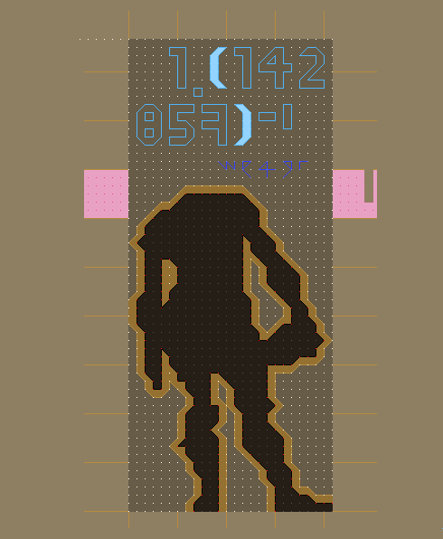
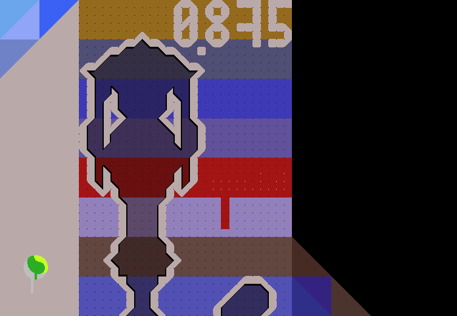

### Robots .. `` --
In this episode ve hafe *2* or *3* robots and a network of nodes.
The number of nodes is restricted to *50*, and all distances betveen
them are equal. The robots are constantly moving with speeds having
only two possible values *{1, 2}*. We have to find a scenario vhere
after minimum number of moves the robots meet each other:
[clck](https://ioinformatics.org/files/ioi1990round2.pdf).


Here is some dumf of the program for CONFIG *5* ***Graph***:
```R
     A---B---C             
    /     \   \          
   D---E---F---G           
  / \ /     \   \       
 H   I---J---K---L---M     
  \ / \     / \     /   
   N   O---P---Q---R       
  / \ /     \ /   /      
 S---T---U---V   W         
  \ / \ / \       \    
   X   Y---Z---a---b       
    \ /   / \            
     c---d---e             
    /     \ /             
   f---g---h               
    \     /               
     i---j       k         
    / \ / \     / \     
   l---m---n---o---p       
    \ /     \ / \ /     
     q---r---s---t         
          \ / \ / \     
           u---v---w       
            \ /           
             x             
speed:   2, 1, 1
nbor[1]: BD, ACF, BG, AEIH, DFI, BGKE, CLF, DN, DEJON, IK, FLQPJ, GKM, LR, HITS, IPT, KQVO, KRVP, MWQ, NTX, NOUYXS, VZYT, PQU, Rb, STc, TUZc, UaedY, Zb, aW, XYdf, Zehc, Zhd, cgi, fh, dejg, fjml, hnmi, po, imq, ijnql, josm, kptsn, kto, lmr, qsu, notvur, opwvs, rsvx, stwxu, tv, uv
nbor[2]: ACFEIH, BDGKE, ACFL, BDFIEJON, AEIHBGKDJON, ACFLQPJDI, BGKME, AEIHTS, AEIHDFKPTS, DEJONFLQP, BGKEMRVPQOI, CLFQPJR, GKMWQ, DNEJOUYXST, DEJONKQVUYXS, FLQPJKRVUIT, FLQPJMWUKVO, LRbKVP, HITSNOUYXc, HITSPVZYUcNX, PQUaedYTZcNOXS, KQVORPZYT, MWQa, NTXOUYSdf, NOUYXSVZTaedf, VZYTbhdecU, UaedYW, ZbR, STcUZehgi, UaedYZhjgXf, UaedYjgZhc, XYdfhjml, cgidej, Zehcdnmif, cgihnmjql, dejgosminqlf, ktopsn, fjmlinqr, fjmlhniosrq, hnmikptsovurjql, poktwvsnurjm, powvsktn, imqjnlsu, lmrnotvusx, josmkptnwvxurq, kptsnovwxur, qsunotvrwx, notvurpwsx, opwvstxu, rsvxtwu
root:    snod(JYh, 0)
snod(YYY, 0x55616ce07c60)
JYh, DTd, OUZ, YYY
```
Here we have *50* nodes, vith *3* bots at positions J,Y, and h, having
speeds *{2, 1, 1}* respectively. After a long thinking the computer
have found out that they will meet at node Y:)





https://youtu.be/cmigCAALq2o